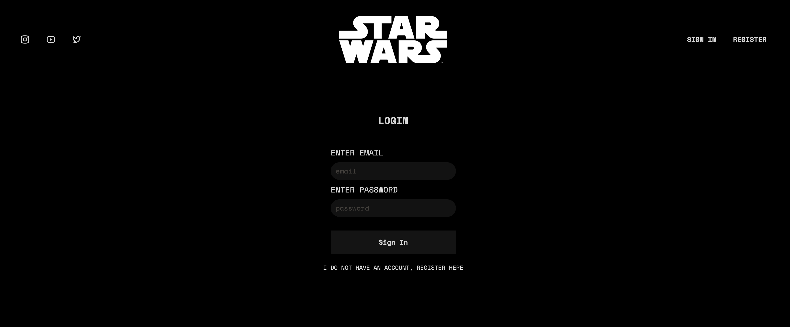
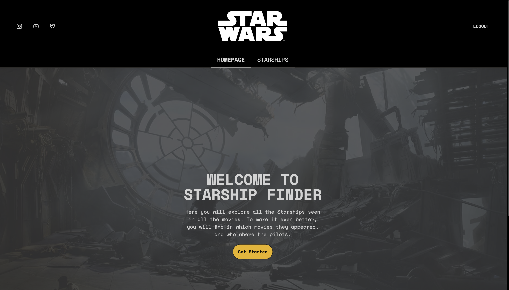
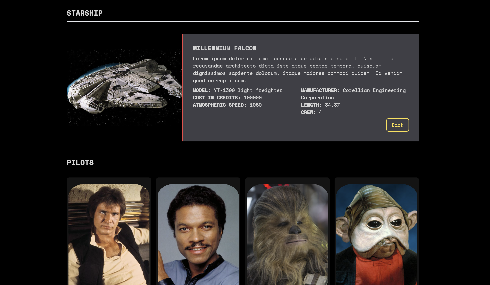

# Star Wars API App

This is a React-based web application that utilizes the Star Wars API to display information about various Star Wars Starships, Films, And Characters.

## Screenshots





## How To Install

To install the React-based web application that utilizes the Star Wars API, follow these steps:

1. Make sure you have Node.js installed on your machine.

2. Open your terminal and clone this repository:

```
https://github.com/gsvaliente/react-sprint-7.git
```

3. Install the project dependencies using pnpm:

```
pnpm install
```

or using yarn:

```
yarn install
```

or using npm:

```
npm install
```

4. Start the development server:

```
pnpm dev
```

or

```
yarn dev
```

or

```
npm run dev
```

5. Open your browser and visit `http://localhost:` with the port that is being used in the terminal to see the application running.

6. Register as a user and enjoy the app.

## Technologies Used

-   Redux Toolkit
-   Firebase
-   React Router
-   Tailwind CSS
-   Daisy UI
-   TypeScript

## Project Structure

The project structure is as follows:

```
star-wars-api/
├── src/
│   ├── features/
│   │   ├── movies.js
│   │   ├── pilots.js
│   │   ├── ships.js
│   │   └── ...
│   ├── pages/
│   │   ├── AppLayout.js
│   │   ├── HomePage.js
│   │   ├── PageNotFound.js
│   │   └── ...
│   ├── ui/
│   │   ├── BackButton.js
│   │   ├── Card.js
│   │   ├── ErrorMessage.js
│   │   ├── Footer.js
│   │   ├── Header.js
│   │   ├── Loader.js
│   │   └── ...
│   ├── App.js
│   ├── index.js
│   └── ...
├── .gitignore
├── package.json
└── README.md
```

The `src` directory contains all the source code for the application. It is further divided into `components`, `pages`, and `services` directories.

-   The `components` directory contains reusable React components such as `CharacterCard`, `FilmCard`, `PlanetCard`, and more.
-   The `pages` directory contains the main pages of the application, such as `CharactersPage`, `FilmsPage`, `PlanetsPage`, and more.
-   The `services` directory contains utility functions and API integration code, such as `api.js`.

The `public` directory contains the `index.html` file, which serves as the entry point for the application.

The root directory also contains the `.gitignore` file, `package.json` file for managing dependencies, and this `README.md` file.

Feel free to explore the code and make any necessary modifications to suit your needs.
